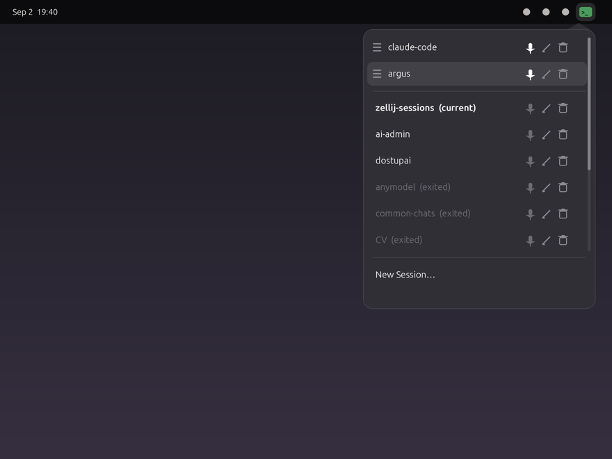

# Zellij Sessions Manager

GNOME Shell extension for managing [Zellij](https://github.com/zellij-org/zellij) terminal sessions from the top panel.




## Features

- **Session list** — all Zellij sessions (active, exited, current) in a dropdown menu
- **Pinned sessions** — pin the sessions you use daily to the top of the list
- **Drag to reorder** — grab a pinned session by its handle and drop it into any slot
- **Sorted list** — unpinned sessions are grouped active first, then exited, alphabetically inside each group
- **Scrollable** — long lists scroll instead of running off the screen
- **Smart open** — click a session to focus its existing window, or open a new terminal if none is found
- **Rename sessions** — inline rename with confirm/cancel buttons
- **Delete sessions** — trash icon to kill active or remove exited sessions
- **New session** — pick a folder and start a fresh Zellij session in it
- **Zero configuration** — uses the system default terminal, no setup required

## Requirements

- GNOME Shell 49+
- [Zellij](https://github.com/zellij-org/zellij) installed and in `$PATH`
- [Zenity](https://gitlab.gnome.org/GNOME/zenity) for the folder picker (preinstalled on most distributions)

## Install

### From GNOME Extensions

Coming soon.

### From a release bundle

```bash
gnome-extensions install --force zellij-sessions-manager@darkwing4.dev.shell-extension.zip
```

### From source

```bash
git clone https://github.com/Darkwing4/zellij-session-manager.git
cd zellij-session-manager
gnome-extensions pack --force .
gnome-extensions install --force zellij-sessions-manager@darkwing4.dev.shell-extension.zip
```

Log out and back in (GNOME Shell cannot be restarted on Wayland), then enable it:

```bash
gnome-extensions enable zellij-sessions-manager@darkwing4.dev
```

## Configuration

The extension works out of the box: sessions open in the terminal your system considers default, resolved through
[`xdg-terminal-exec`](https://gitlab.freedesktop.org/terminal-wg/specifications) with a GIO fallback.

To force a specific terminal instead, set `terminal-argv` — `{cmd}` is replaced by the zellij arguments, `{cwd}` by the
session folder, `{title}` by the window title:

```bash
gsettings --schemadir ~/.local/share/gnome-shell/extensions/zellij-sessions-manager@darkwing4.dev/schemas \
  set org.gnome.shell.extensions.zellij-sessions terminal-argv \
  "['kitty', '--directory={cwd}', '--title={title}', '--', '{cmd}']"
```

`terminal-wm-classes` narrows the window search to specific terminals when focusing an already open session. Empty (the
default) matches any window whose title comes from Zellij:

```bash
gsettings --schemadir ~/.local/share/gnome-shell/extensions/zellij-sessions-manager@darkwing4.dev/schemas \
  set org.gnome.shell.extensions.zellij-sessions terminal-wm-classes "['kitty']"
```

Pinned sessions and their order live in `pinned-sessions` and are managed from the menu.

## How it works

The extension adds an icon to the panel. Opening the menu runs `zellij list-sessions --no-formatting` and builds the list
from its output. Clicking a session searches open windows for a matching title (`Zellij (<name>)`) — if found it focuses
that window, otherwise it launches `zellij attach <name> -c` in a new terminal. Renaming uses
`zellij -s <old> action rename-session <new>`; deleting uses `kill-session` for running sessions and `delete-session` for
exited ones.

## License

[GPL-2.0](LICENSE)
